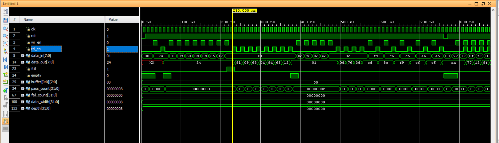

# Synchronous FIFO – RTL Design & Verification

## Overview
This project implements a parameterized **Synchronous FIFO (First-In-First-Out)** memory in Verilog and verifies it using a self-checking SystemVerilog testbench. It was built as part of my ongoing practice in RTL design and design verification, with the goal of understanding pointer-based FIFO architectures and writing scoreboard-based testbenches.

## Files
| File | Description |
|---|---|
| `Synchronous_FIFO.v` | RTL design of the synchronous FIFO (DUT) |
| `Synchronous_FIFO_tb.sv` | Self-checking SystemVerilog testbench |

## Design Description
The FIFO is built using the classic **extra-bit pointer** technique to distinguish between the full and empty conditions without needing a separate counter.

**Parameters:**
- `data_width` = 8 (width of each FIFO entry)
- `depth` = 8 (number of entries)

**Ports:**
- `clk`, `rst` – clock and active-low asynchronous reset
- `wr_en`, `rd_en` – write enable and read enable
- `data_in` – data written into the FIFO
- `data_out` – data read out of the FIFO
- `full`, `empty` – status flags

**How it works:**
- `write_pt` and `read_pt` are one bit wider than needed to address the memory (`AW = $clog2(depth)`). The extra MSB is used to detect wraparound.
- `full` is asserted when the pointers match on the lower address bits but differ on the extra MSB (write pointer has wrapped around one more time than read pointer).
- `empty` is asserted when both pointers are exactly equal.
- Writes only happen when `wr_en && !full`, and reads only happen when `rd_en && !empty`, so the memory is protected from overflow/underflow.

## Testbench Description
The testbench (`Synchronous_FIFO_tb.sv`) is self-checking: it maintains a behavioral **reference model** using a SystemVerilog queue (`buffer[$]`) that mirrors what the FIFO *should* contain, and compares the DUT's actual output against this expected value on every read.

**Key tasks:**
- `reset_dut` – applies reset and clears the reference queue
- `write_fifo` – writes a random value if the FIFO isn't full, and pushes the same value into the reference queue
- `read_fifo` – pops the expected value from the reference queue and compares it against `data_out`
- `check_data` / `check_bit` – scoreboard comparison functions that track `pass_count` / `fail_count`
- `write_and_read` – performs a **simultaneous** write and read on the same clock edge using `fork...join`

### Why `fork...join` for simultaneous read/write
A plain `write_fifo(); read_fifo();` sequence takes two full clock cycles and never actually exercises `wr_en` and `rd_en` together. To specifically test the FIFO's behavior when a read and a write happen **on the same clock edge** (an important corner case for pointer/flag logic), the `write_and_read` task forks two branches — one driving the write side, one driving the read side — so both `wr_en` and `rd_en` get asserted on the same `negedge clk`.

To avoid a scoreboard race (where the write branch could push into the reference queue before the read branch samples it, corrupting the expected order), `!full` and `!empty` are captured into `do_wr` / `do_rd` **before** entering the fork block, so the read/write decision doesn't depend on which branch happens to execute first.

> **Note:** `fork...join` and the reference queue are testbench-only constructs and are **not synthesizable** — they're used purely for verification, not for the FIFO design itself.

## Test Scenarios Covered
1. Reset behavior – checks `full = 0` and `empty = 1` after reset
2. Single write followed by a single read
3. Filling the FIFO completely (write until full)
4. Draining the FIFO completely (read until empty)
5. Partial write/read sequences (5 writes, 4 reads)
6. Alternating write-then-read across multiple iterations
7. Simultaneous read and write on the same clock edge (using `fork...join`)
8. Final pass/fail summary printed at the end of simulation

## How to Run
1. Open `Synchronous_FIFO_1.xpr` in Xilinx Vivado.
2. Set `Synchronous_FIFO_tb` as the simulation top module.
3. Run Behavioral Simulation.
4. Check the Tcl console / simulation log for `$display` messages and the final pass/fail count.

## Sample Output (expected)
```
time = 20000, Pass : acutal = 0, expected = 0
time = 20000, Pass : acutal = 1, expected = 1
time = 60000 case passed : the actual is 100100, expected is 100100 
time = 240000 case passed : the actual is 10000001, expected is 10000001 
time = 260000 case passed : the actual is 1001, expected is 1001 
time = 280000 case passed : the actual is 1100011, expected is 1100011 
time = 300000 case passed : the actual is 1101, expected is 1101 
time = 320000 case passed : the actual is 10001101, expected is 10001101 
time = 340000 case passed : the actual is 1100101, expected is 1100101 
time = 360000 case passed : the actual is 10010, expected is 10010 
time = 380000 case passed : the actual is 1, expected is 1 
time = 500000 case passed : the actual is 1101, expected is 1101 
time = 520000 case passed : the actual is 1110110, expected is 1110110 
time = 540000 case passed : the actual is 111101, expected is 111101 
time = 560000 case passed : the actual is 11101101, expected is 11101101 
time = 600000 case passed : the actual is 10001100, expected is 10001100 
time = 640000 case passed : the actual is 11111001, expected is 11111001 
time = 680000 case passed : the actual is 11000110, expected is 11000110 
time = 720000 case passed : the actual is 11000101, expected is 11000101 
time = 760000 case passed : the actual is 10101010, expected is 10101010 
time = 780000, Pass : acutal = 0, expected = 0
time = 780000, Pass : acutal = 1, expected = 1
time = 820000 case passed : the actual is 1110111, expected is 1110111 
time = 840000 case passed : the actual is 10010, expected is 10010 
time = 860000 case passed : the actual is 10001111, expected is 10001111 
time = 880000 case passed : the actual is 11110010, expected is 11110010 
...
pass count : 26, fail count : 0
All test case passed
```

## Waveform Verification
Below is the simulation waveform captured from the run, showing `clk`, `rst`, `wr_en`, `rd_en`, `data_in`, `data_out`, `full`, `empty`, and the scoreboard counters (`pass_count`, `fail_count`).



**Observations from the waveform:**
- **Reset behavior:** at the start, `rst = 0` while `full = 1` and `empty = 0` are the default (unreset) register values; once `rst` goes high, the pointers clear and `empty` correctly asserts.
- **Sequential write/read regions:** in the early part of the trace, `wr_en` pulses alone for several cycles (loading `24, 81, 09, 63, 0d, 8d, 65, 12...` into the FIFO), followed by `rd_en` pulsing alone to drain those same values back out on `data_out` — matching the write-then-read test blocks.
- **Simultaneous write/read region:** around the region where `wr_en` and `rd_en` are both toggling on the same clock edges (visible where the two signal rows show overlapping pulses rather than one following the other), the FIFO is being written and read at the same time — this is the `fork...join` (`write_and_read`) test in action. `data_in` and `data_out` are both changing every cycle here instead of the FIFO filling up first.
- **Scoreboard counters:** `pass_count` increments steadily throughout (up to the final value) while `fail_count` stays at `00000000` the entire simulation, confirming every comparison between `data_out` and the expected value from the reference queue matched.

This waveform is the visual proof behind the `$display` log from the earlier run — the `check_data()` passes reported in simulation text correspond exactly to the `data_out` values changing correctly in sync with `rd_en` on this trace.

## What I Learned
- How FIFO full/empty detection works using an extra pointer bit instead of a counter
- How to build a queue-based reference model for self-checking testbenches
- The difference between sequential testbench code and concurrent `fork...join` processes, and how simulator scheduling (Active region execution order) can introduce subtle race conditions if not handled carefully
- Why `fork...join` and other verification constructs are simulation-only and are never synthesized into hardware

## Possible Future Improvements
- Add randomized/constrained-random stimulus instead of fixed loop counts
- Add `join_none` + `wait fork` based stress testing with overlapping writes/reads
- Add coverage collection (functional coverage on full/empty/simultaneous read-write cases)
- Convert to a UVM-based testbench for more scalable verification
